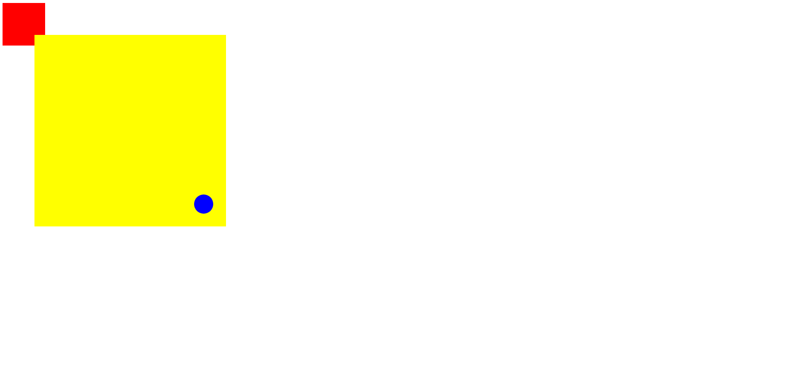

这个属性他是相对于视口而言的, 也就是说, 如果你设置了一个元素的fixed属性, 那么它将始终位于浏览器窗口的某个位置, 即使页面滚动也不会动, 但是如果其父元素使用了 transform 或 perspective 等属性, 那么它将随着父元素的移动而移动。

```html
<!DOCTYPE html>
<html lang="en">
<head>
    <meta charset="UTF-8">
    <meta name="viewport" content="width=device-width, initial-scale=1.0">
    <title>Document</title>
    <style>
        .a {
            width: 100px;
            height: 100px;
            background-color: red;
        }

        .b {
            position: fixed;
            right: 20px;
            bottom: 20px;
            width: 30px;
            height: 30px;
            border-radius: 50%;
            background-color: blue;
        }
    </style>
</head>
<body style="position: relative;">
    <div class="a">

    </div>
    <div>
        <div style="position: absolute; height: 300px; width: 300px; background-color: yellow; top: 150px; left: 150px; transform: scale(1.5);">
            <div class="b"></div>
        </div>
    </div>
</body>
</html>
```

